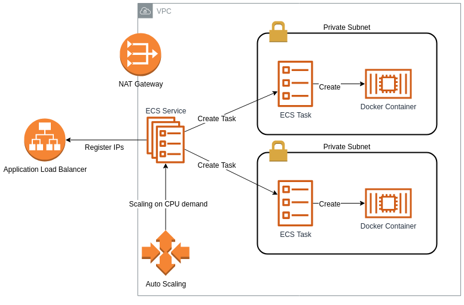

# aws-fargate-playground

This project serves as a playground for AWS Fargate and related
resources. AWS Fargate is a serverless compute engine for containers
that works with both Amazon Elastic Container Service (ECS) and
Amazon Elastic Kubernetes Service (EKS).

## Infrastructure



The infrastructure contains the following components:
 * Virtual Private Network (VPC) containing 2 private and 2 public subnets
 * NAT gateway attached to the private subnets
 * Internet facing application load balancer (ALB) with a SSL listener
 * Load balancer application logs stored in a S3 bucket
 * ECS cluster serving AWS fargate container images
 * Autoscaling group scaling the ECS cluster in/out based on CPU utilization
 * Cloudwatch dashboard showing cpu utilization and memory usage

## Deploy

You can deploy the fargate-playground with

```
./bin/deploy.sh myplayground
```

Before executing this script you should open it and change the values
for `HOSTED_ZONE_NAME`. For this values you need to setup a hosted
zone for a given domain name in AWS Route53.

## Test

In order to see the autoscaling work run a HTTP benchmark tool like
[hey](https://github.com/rakyll/hey) like so

```
hey -n "$((1000 * 1000 * 100)) -c 50 -q 100 https://myplayground.<your domain>
```

Then navigate to the AWS ECS console and wait until the average
load of any running ECS tasks exceeds the given threshold 
(see `CPU_TARGET_VALUE_FOR_SCALING` in [bin/deploy.sh](./bin/deploy.sh)).
This event will trigger ECS to create more ECS tasks/container.